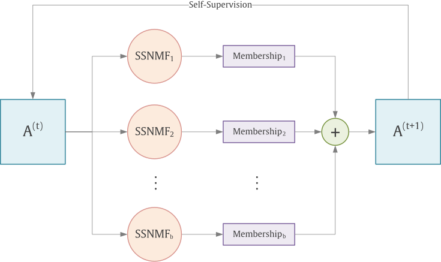

# S4NMF
## Self-Supervised Semi-Supervised Nonnegative Matrix Factorization for Data Clustering
Jut run 'S4NMF.ipynb'.

  *Jovan Chavoshinejad, Seyed Amjad Seyedi, Fardin Akhlaghian Tab, navid Salahian, *
  
  *Pattern Recognition 2023*

  
  *https://doi.org/10.1016/j.patcog.2022.109282*

  # Abstract

Semi-supervised nonnegative matrix factorization exploits the strengths of matrix factorization in successfully learning part-based representation and is also able to achieve high learning performance when facing a scarcity of labeled data and a large amount of unlabeled data. Its major challenge lies in how to learn more discriminative representations from limited labeled data. Furthermore, self-supervised learning has been proven very effective at learning representations from unlabeled data in various learning tasks. Recent research works focus on utilizing the capacity of self-supervised learning to enhance semi-supervised learning. In this paper, we design an effective Self-Supervised Semi-Supervised Nonnegative Matrix Factorization (S4NMF) in a semi-supervised clustering setting. The S4NMF directly extracts a consensus result from ensembled NMFs with similarity and dissimilarity regularizations. In an iterative process, this self-supervisory information will be fed back to the proposed model to boost semi-supervised learning and form more distinct clusters. The proposed iterative algorithm is used to solve the given problem, which is defined as an optimization problem with a well-formulated objective function. In addition, the theoretical and empirical analyses investigate the convergence of the proposed optimization algorithm. To demonstrate the effectiveness of the proposed model in semi-supervised clustering, we conduct extensive experiments on standard benchmark datasets.
